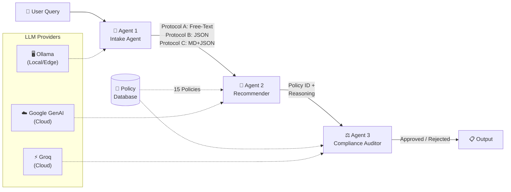

# 🛡️ Multi-Agent Insurance Policy Advisory System

> **Evaluating Communication Protocol Design in Multi-Agent Systems (MAS):**  
> Free-Text vs Structured JSON vs Markdown JSON

## 📋 Project Overview

This project implements a **3-agent LangGraph pipeline** designed to recommend insurance policies based on natural language user queries. However, its primary purpose is to serve as an **empirical testbed for comparing inter-agent communication protocols**.

When building Multi-Agent Systems (MAS), developers must choose how agents talk to each other. Do they pass free-text, strict JSON, or a hybrid? This project runs a mass evaluation across 50 simulated users to quantitatively measure the impact of these protocols on system accuracy, reliability, and speed.

### 🧪 Why Use Smaller Models for Evaluation?
For this evaluation, we purposefully target mid-tier and edge models (like **LLaMA 3 8B/17B** or **Qwen 2.5 7B**) rather than frontier models (like GPT-4o or Claude 3.5 Sonnet). 
* **The "Too Smart" Problem:** Frontier models are incredibly resilient. They can parse heavily malformed data and infer missing context effortlessly. If you test protocols on GPT-4, you won't see a difference—it succeeds regardless.
* **Exposing Protocol Flaws:** Smaller models are highly sensitive to prompt structure, parsing rules, and context framing. By using these models, the *quality of the communication protocol* becomes the determining factor in task success, allowing us to accurately measure which protocol design is actually superior.

---

## 🔬 The Three Protocols Tested

| Protocol | Format | Description & Rationale |
|----------|--------|-------------------------|
| **Protocol A** | `text` | **Free-Text Summaries:** The Intake agent writes a natural language paragraph describing the user. *Pros:* Easy to generate. *Cons:* Ambiguous for the Recommender to parse. |
| **Protocol B** | `json` | **Strict JSON:** The Intake agent outputs raw JSON. *Pros:* Highly structured and predictable. *Cons:* LLMs sometimes struggle to generate strict JSON without reasoning space, leading to formatting errors (e.g., unescaped newlines). |
| **Protocol C** | `markdown_json` | **Hybrid (Reasoning + JSON):** The agent provides 2-3 sentences of natural language reasoning, followed by a fenced ` ```json ` block. *Pros:* Gives the LLM space to "think" before committing to a rigid schema, drastically reducing hallucinations and formatting errors. |

---

## 🏗️ Architecture



### Agent Responsibilities

| Agent | Role | Input | Output |
|-------|------|-------|--------|
| **Intake** | Parses user's natural language query | Raw user text | Structured/unstructured profile (depends on Protocol) |
| **Recommender** | Selects best policy from DB | Intake payload | Policy ID + reasoning |
| **Auditor** | Compliance check against original query | All prior context | Approved/Rejected + reasoning |

### 🔀 Hybrid Edge/Cloud Orchestration
The pipeline is designed to be completely modular. Using the provided frontend UI, you can independently route each of the three agents to a entirely different LLM provider on the fly. 
For example, you can configure:
- **Agent 1 (Intake)** to run locally on your edge device via **Ollama** (zero API cost for parsing PII).
- **Agent 2 (Recommender)** to run on **Google GenAI** (Gemini 1.5 Flash).
- **Agent 3 (Auditor)** to run on **Groq** (LLaMA-3) for ultra-fast compliance verification.

---

## 📁 File Structure

```
agent-communication-protocol/
├── app.py              # Streamlit interactive UI
├── evaluate.py         # Mass evaluation engine with checkpointing & API key rotation
├── generate_summary.py # Script to generate JSON reports mid-evaluation
├── graph.py            # LangGraph pipeline (nodes + edges)
├── prompts.py          # System prompts (engineered for strict JSON compliance)
├── llm_config.py       # LLM factory & API Key Round-Robin logic
├── .env                # API keys (not committed)
├── .env.example        # Template for .env
├── data/
│   ├── mock_users.json     # 50 test users with expected policies
│   └── mock_policies.json  # 15 mock insurance policies
└── README.md
```

---

## 🚀 Setup Instructions

### 1. Clone & Create Virtual Environment

```bash
git clone <repository-url>
cd agent-communication-protocol
python -m venv venv

# Windows
.\venv\Scripts\activate
# macOS/Linux
source venv/bin/activate
```

### 2. Install Dependencies

```bash
pip install -r requirements.txt
```

### 3. Configure Environment Variables

This system is built to process massive evaluations quickly using **Groq**. To bypass strict free-tier rate limits, the system features a built-in **API Key Round-Robin**.

1. Copy the example file: `cp .env.example .env`
2. Add multiple Groq API keys to `.env`:

```env
# Google GenAI (Gemini / Gemma models)
LLM_PROVIDER=groq
GOOGLE_API_KEY=your-google-api-key-here

# Groq Round-Robin API Keys (Add as many as you want)
GROQ_API_KEY_1=your_first_key
GROQ_API_KEY_2=your_second_key
GROQ_API_KEY_3=your_third_key
```

*The system will automatically detect the keys, cycle through them evenly on every LLM call, and multiply your TPM/RPM limits accordingly!*

---

## ▶️ Running the System

### 1. Interactive Demo UI
Launch the Streamlit app to manually test the MAS, swap protocols, and trace the execution path of the agents in real-time.

```bash
streamlit run app.py
```

**UI Features:**
* **Dynamic Agent Routing:** A sidebar configuration panel allows you to independently select the LLM Provider (Groq, Google GenAI, or local Ollama) for the Intake, Recommender, and Auditor agents. 
* **Protocol Switching:** Instantly swap between Protocol A (Text), B (JSON), and C (Markdown JSON) to see how the system behaves differently under each communication standard.
* **Execution Tracing:** Watch the live data payload as it is passed from agent to agent in real-time, displaying exactly what information was extracted, recommended, and audited.

### 2. Mass Evaluation Engine
Run the fully automated evaluation suite. This processes 50 users across all 3 protocols (150 total runs).

```bash
python evaluate.py
```
**Features of the Evaluation Engine:**
* **Fault-Tolerant Checkpointing:** Every single run is saved to `checkpoint.json`. If you hit a rate limit or `Ctrl+C` the script, simply run it again—it will resume exactly where it left off.
* **Live CSV Logging:** Results are streamed line-by-line to `evaluation_log.csv`.
* **Dynamic Pacing:** The script paces itself based on the `API_DELAY_SECONDS` variable to respect rate limits.

### 3. Generate Summary Report
If you stop the evaluation early and want to generate statistics on the data collected so far, run:

```bash
python generate_summary.py
```
This instantly compiles `evaluation_summary.json` containing success rates, parse errors, and latency metrics for your final project report.

---

## 📊 Metrics Tracked

| Metric | Description |
|--------|-------------|
| **Task Success Rate** | % of runs where recommended policy matches expected AND auditor approved |
| **Auditor Rejection Rate** | % of runs where the auditor caught a mistake and rejected the recommendation |
| **Parsing Error Rate** | % of runs with JSON parse failures or LLM hallucination errors |
| **Average Latency** | Mean end-to-end pipeline time per run |
| **Average Payload Chars** | Mean character count of inter-agent payloads (tests bandwidth efficiency) |

---

## 🛠️ Tech Stack

- **Framework**: [LangGraph](https://github.com/langchain-ai/langgraph) + [LangChain](https://github.com/langchain-ai/langchain)
- **UI**: [Streamlit](https://streamlit.io/)
- **LLM Providers**: Groq, Google GenAI, Ollama
- **Language**: Python 3.11+
